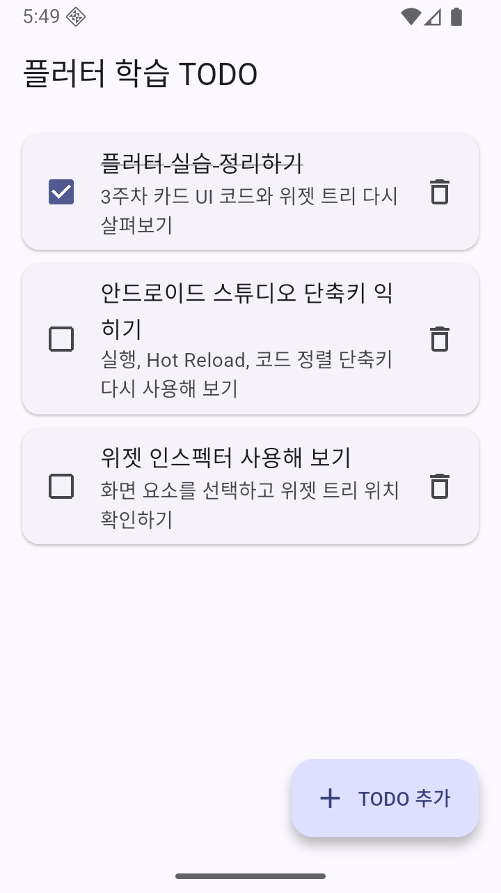
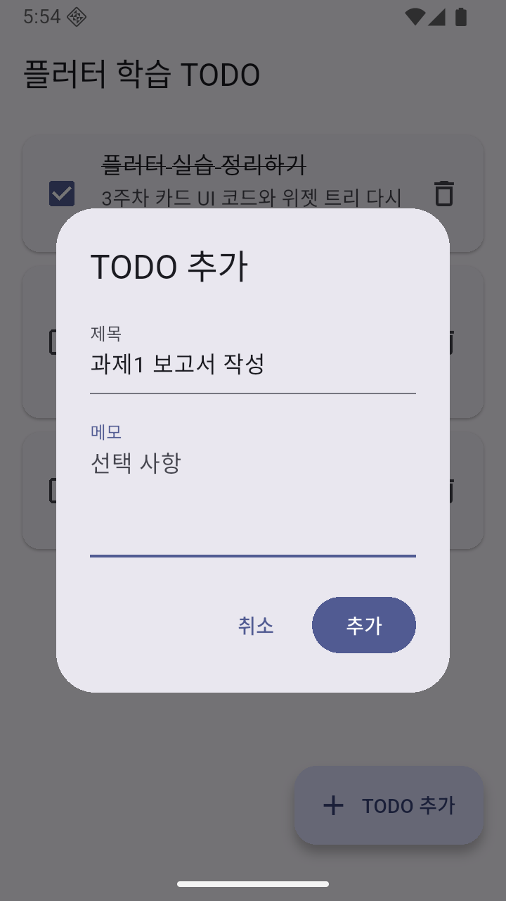
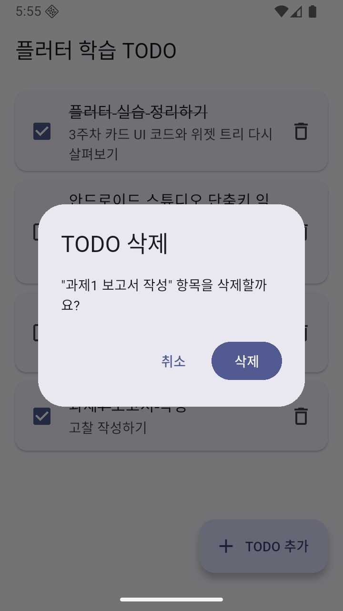
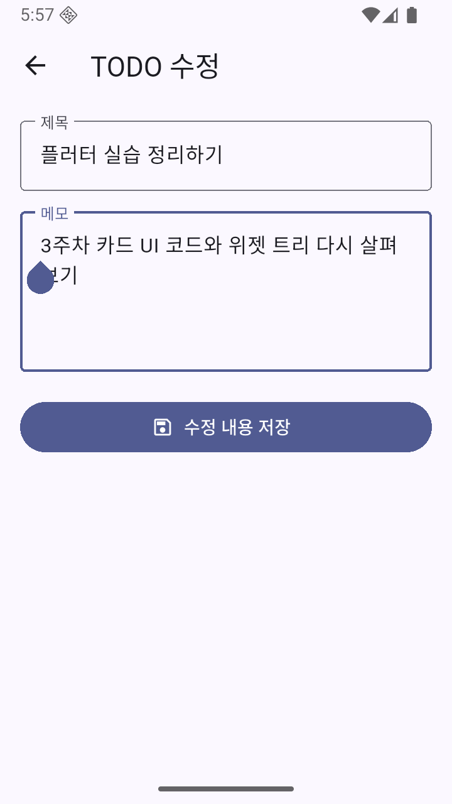

# Flutter Todo Manager 실습

모바일프로그래밍 수업에서 사용하는 Todo Manager 실습 프로젝트입니다.

이 저장소는 수업 운영에 맞춰 **Android 실습 기준**으로 구성되어 있습니다.

## 완성 화면 미리보기

수업을 따라가며 다음과 같은 Todo Manager를 완성합니다.

| 목록 | 추가 | 삭제 | 수정 |
|:---:|:---:|:---:|:---:|
|  |  |  |  |

이 저장소에는 **수업 시작 코드와 Checkpoint 코드만** 들어 있습니다.  
수업에서는 `lib/main.dart`에서 직접 코드를 수정하면서 앱을 완성합니다.

## 1. 프로젝트 받기

터미널에서 다음 명령을 실행합니다.

```bash
git clone https://github.com/suseol/app04_todo_manager.git
cd app04_todo_manager
flutter pub get
```

Android Studio에서 `app04_todo_manager` 폴더를 열어도 됩니다.

## 2. 실습 시작

기본 실행 파일은 다음입니다.

```text
lib/main.dart
```

처음에는 최소한의 Todo 화면만 들어 있습니다.  
수업 설명에 따라 `main.dart`를 계속 수정하면서 목록, 상태 변경, 입력, 검증, 삭제, 화면전환 기능을 구현합니다.

실행:

```bash
flutter run
```

코드를 수정한 뒤에는 Hot Reload를 활용합니다.

## 3. Checkpoint 사용

`lib/checkpoints/`에는 수업 중 다시 합류할 수 있는 복구 코드가 있습니다.

```text
lib/checkpoints/
├─ checkpoint_1_state_list.dart
├─ checkpoint_2_add_form.dart
└─ checkpoint_3_delete_confirm.dart
```

### Checkpoint 1

목록 표시와 상태 변경까지 완료된 코드입니다.

### Checkpoint 2

Todo 입력과 Form 검증까지 완료된 코드입니다.

### Checkpoint 3

삭제 확인 기능까지 완료된 코드입니다.

Checkpoint는 정답을 미리 확인하기 위한 파일이 아니라, 코드 오류나 진도 차이로 다음 실습을 이어가기 어려울 때 사용하는 **복구 지점**입니다.

가능하면 `lib/main.dart`에서 직접 실습을 진행하세요.

## 4. Checkpoint에서 다시 시작하는 방법

필요한 Checkpoint 파일의 전체 내용을 복사하여 `lib/main.dart`의 내용을 교체합니다.

예를 들어 Checkpoint 2에서 다시 시작하려면:

1. `lib/checkpoints/checkpoint_2_add_form.dart`를 엽니다.
2. 전체 코드를 복사합니다.
3. `lib/main.dart`의 기존 내용을 전체 교체합니다.
4. 저장한 뒤 Hot Reload 또는 다시 실행합니다.

## 5. 수업에서 다루는 주요 내용

- `TodoItem` 데이터 모델
- `ListView.builder`를 이용한 반복 목록
- `StatefulWidget`, `State`, `setState()`
- Checkbox와 완료 상태
- `TextField`, `TextFormField`
- `Form`과 `validator`
- Dialog와 결과 반환
- Todo 추가와 삭제
- `Navigator.push()`, `Navigator.pop()`
- 화면 간 데이터 전달

## 6. Solution 제공

완성 Solution 코드는 수업 시작 전에 공개하지 않습니다.

수업이 끝난 뒤 이 저장소에 Solution이 추가되면 다음 명령으로 받을 수 있습니다.

```bash
git pull
```

## 7. 주의사항

- 실습 전에 기존에 수정하던 다른 Flutter 프로젝트와 폴더를 혼동하지 않도록 확인하세요.
- Checkpoint를 사용하기 전에 현재 작성한 `main.dart`가 필요하면 별도로 백업하세요.
- 이 프로젝트는 별도의 외부 패키지나 필수 asset 없이 진행합니다.
